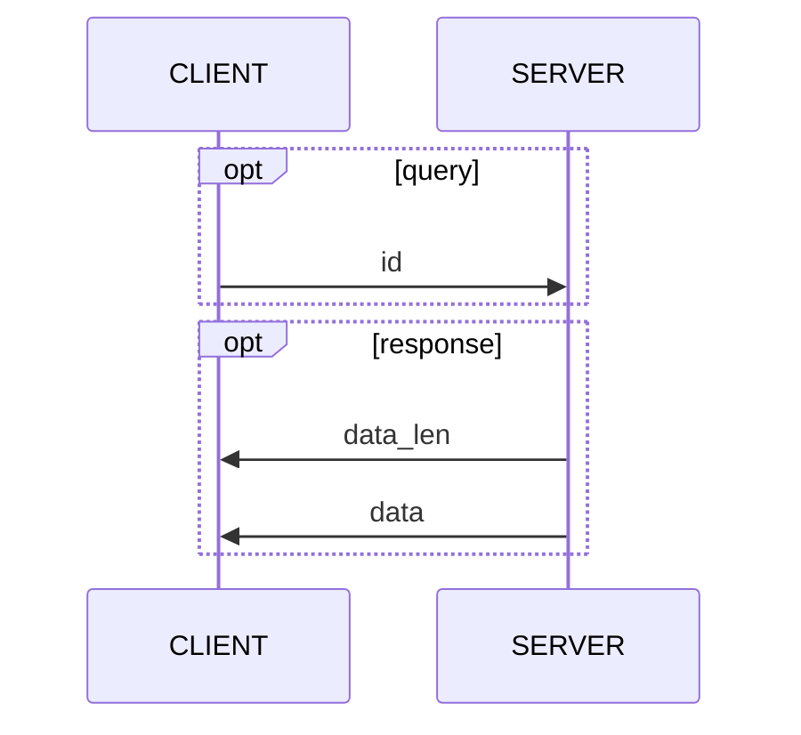
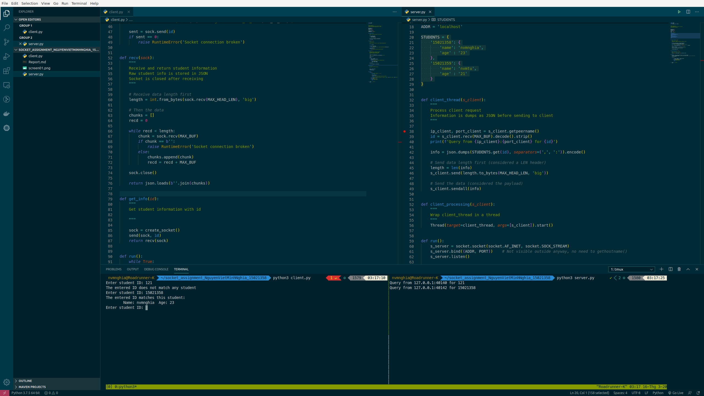

# Service-oriented Architecture INT 3505 1

## Homework 1: Socket programming

### 1. Team member

|   | Student name            | ID       |
|---|:------------------------|:---------|
| 1 | Nguyễn Việt Minh Nghĩa | 15021358 |

### 2. How to run

Run the server first,

```bash
python3 server.py
```

then the client

```bash
python3 client.py
```

Enter the ID to get the information.

### 3. Description



As TCP transmission doesn't have `EOT`, the size of the data must be known beforehand.

First, the client sends the id (`MAX_ID_LEN=64` bytes max) to the server.

Then the server replies with the length of the data (itself `MAX_HEAD_LEN=4` bytes max), simulating a LEN header.

Finally, after obtaining the data size to read, the client receives data from the server, in `MAX_BUF=4096`-byte chunk.

### 4. Screenshot


