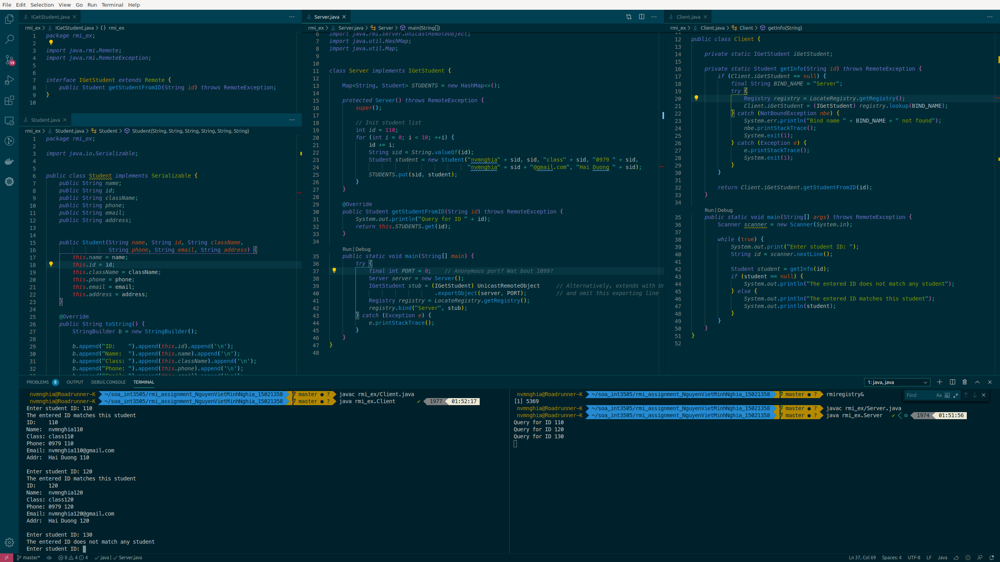

# Service-oriented Architecture INT 3505 1

## Homework 2: RMI programming

### 1. Team member

|   | Student name            | ID       |
|---|:------------------------|:---------|
| 1 | Nguyễn Việt Minh Nghĩa | 15021358 |

### 2. How to run

```bash
# Go to classpath
cd rmi_ex/src

# Start rmiregistry daemon, at src folder
# Otherwise rmiregistry doesn't know how to find classes,
# causing ClassNotFound exception
rmiregistry&

# Start server
javac rmi_ex/Server.java
java rmi_ex.Server

# Start client
javac rmi_ex/Client.java
java rmi_ex.Client
```

Enter the ID to get the information.

### 3. Screenshot


